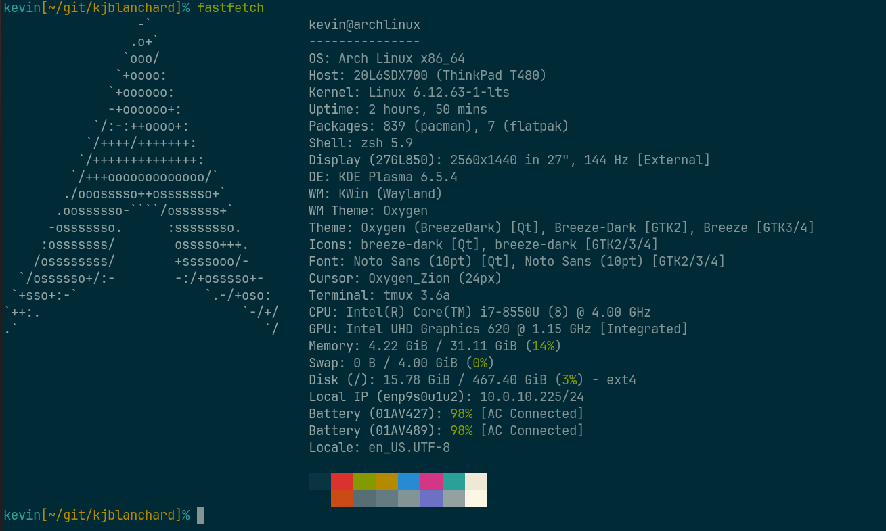

# Hi 👋, I'm Kevin Blanchard

## A tinkerer in various tech

---

## Connect with me

- [LinkedIn](https://linkedin.com/in/kevin-blanchard-51399074)

---

## Languages and Tools

  
  
  
  
  
  
  
  
  
  
  
  
  
  
  
  
  

